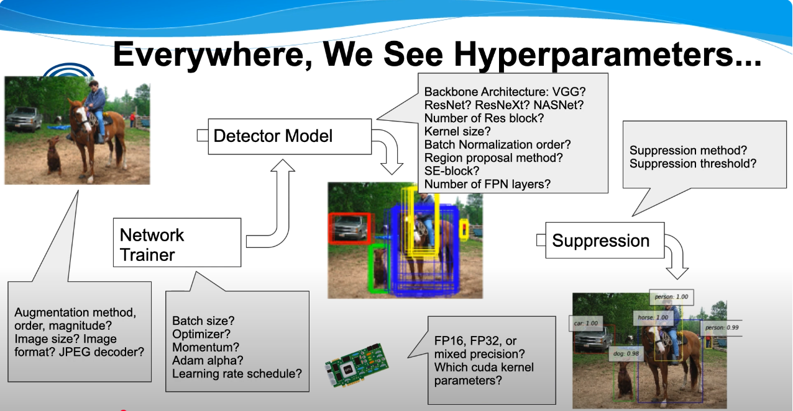
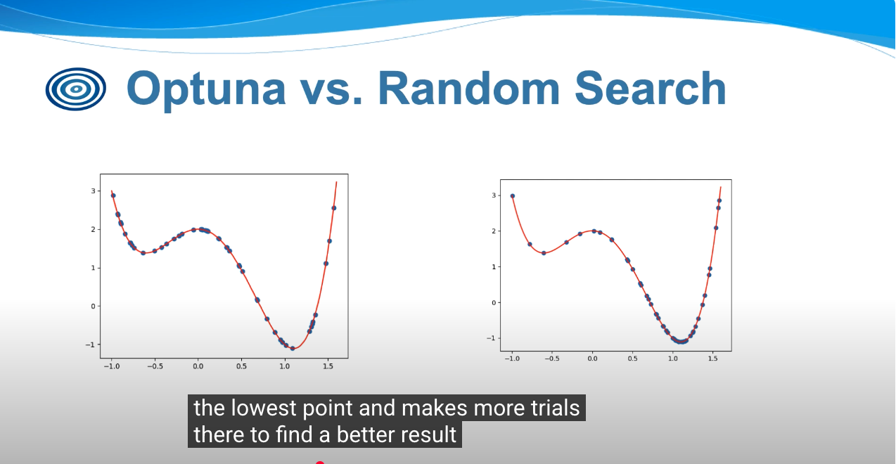
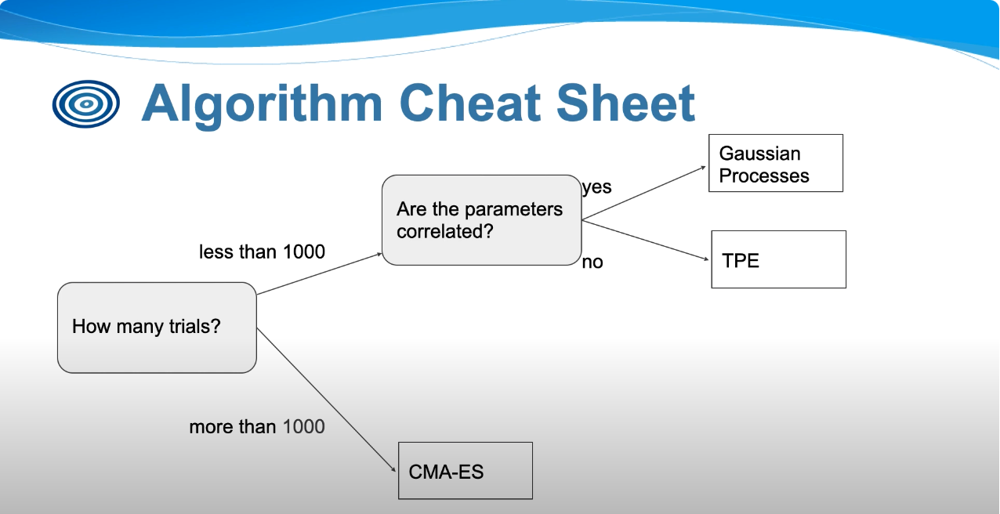
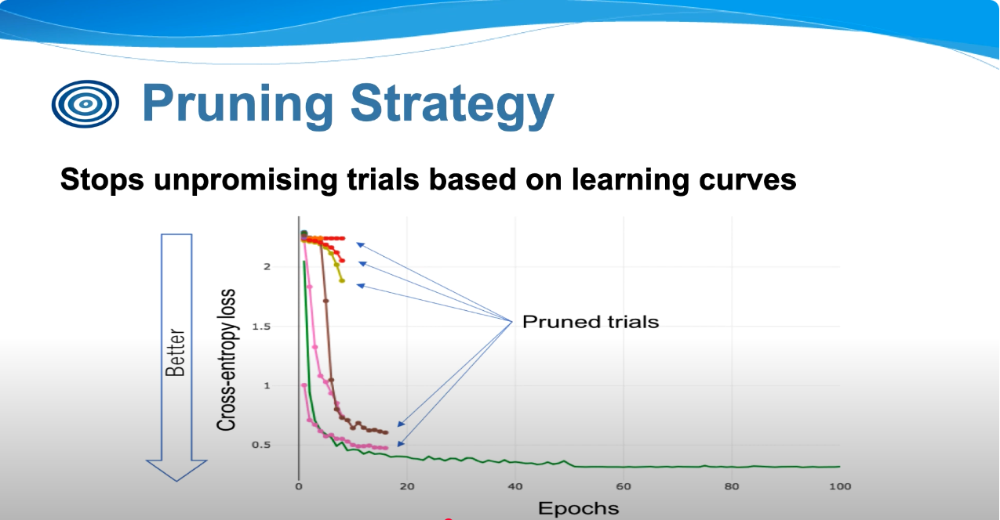
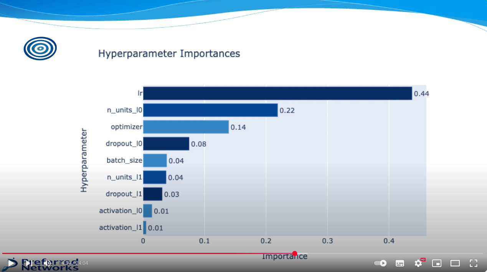
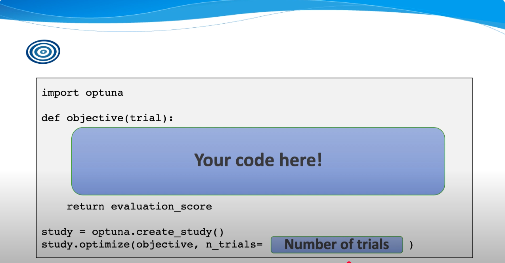

# Learn Optuna

1. tutorial: <https://www.youtube.com/watch?v=P6NwZVl8ttc>
2. there are so many hyperparameters, we just impossible to manully adjust them. 

## sampling strategy

   1. sampling strategy: how to sample hyperparameters. instead of random or grid search, optuna use [bayesian] optimization to sample hyperparameters. it will sample the hyperparameters based on the previous trials. so it will sample the hyperparameters that are more likely to be better. 
   2. Samplers:
      1. Model based
         1. TPE(default): bayesian optimization based on kernel fitting
         2. GP: bayesian optimization based on Gaussian processes
         3. CMA-ES: meta-heuristics algorithm for continuous space
      2. Other Methods
         1. Random search
         2. Grid search
         3. User-defined algorithm
   3. how to choose sampler? there is a cheat sheet. 

## Prunners: Stopping Trials Early

   1. pruning strategy: how to prune the unpromising trials, so you could terminate early to provide more time to better trials. stops unpromissing trials based on learning curve. 

## Scale up

1. just use a single database as the sync point, different programs on different machines can work together to optimize the same hyperparameters.

## Visualization

1. ```optuna.visualization.plot_contour()```
2. optuna dashboard: <https://github.com/optuna/optuna-dashboard>

## Hyperparameter Importance

1. optuna.importance.get_param_importances(study, target=None, normalize=False) after running a small start test, optuna can give you the importance of each hyperparameter. this is very useful to understand which hyperparameters are important and which are not. 

## work with pytorch

1. high level overview: 

## best practices

1. the code of network training code and the optuna code should be separated as much as possible!
